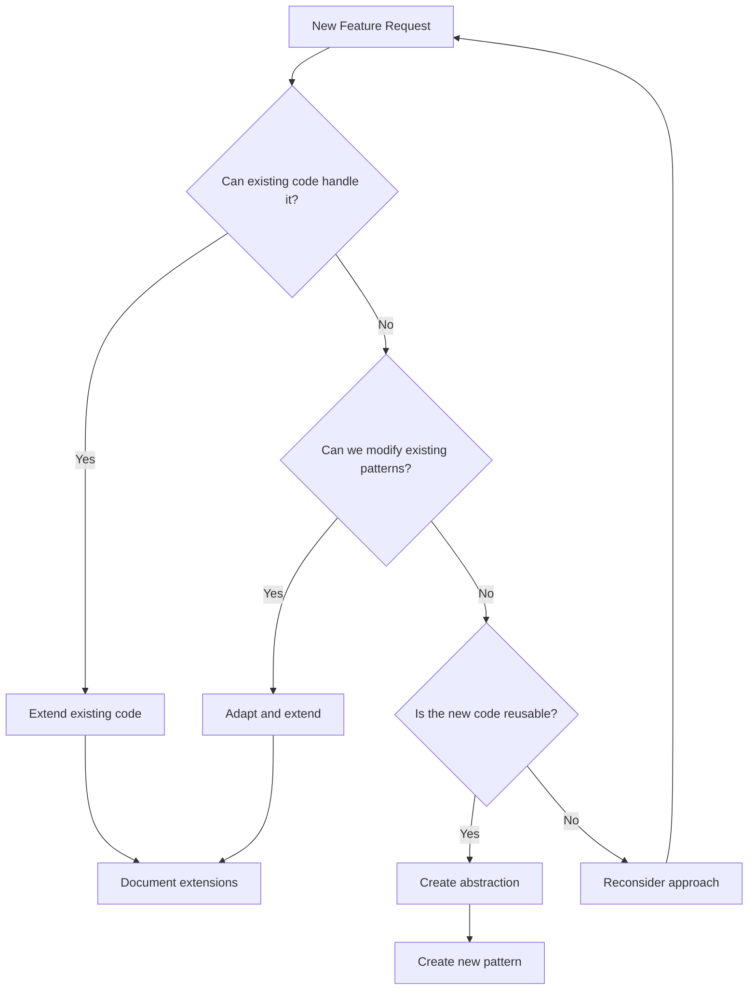

<coding_guidelines>
# AGENTS Guide – `src/lib/`

## 1. Package Identity

- `src/lib` is the **core library** for this app: Firebase init, Firestore helpers, resource modules, Svelte 5 stores, UI primitives (shadcn + Tailwind), Zod schemas, generic patterns, and tests.
- All non-trivial business logic and integration with external services should live here, not in route files or raw components.

---

## 2. Setup & Run (Library-Focused)

Commands are run from the repo root:

```bash
npm run check   # Typecheck Svelte components + TS in src/lib and routes
npm run lint    # Lint everything, including src/lib
npm run test    # Vitest tests (e.g., src/lib/__tests__/todos.test.ts)
```

Keep these green before and after modifying anything under `src/lib/`.

---

## 3. Patterns & Conventions (MOST IMPORTANT)

### 3.1 File Organization

- `src/lib/firebase.ts` – Firebase initialization (browser + server safe).
- `src/lib/firebase/firestore.ts` – Firestore CRUD and subscription helpers.
- `src/lib/server/resources/*.ts` – Firestore-backed resource modules (e.g., `todos.ts`).
- `src/lib/stores/*.svelte.ts` – Svelte 5 rune-based stores that wrap resources (e.g., `auth.svelte.ts`, `todos.svelte.ts`).
- `src/lib/patterns/**` – Generic capability patterns (auth, resources, forms, UI) that higher-level features should reuse.
- `src/lib/components/ui/**` – shadcn-svelte primitives (button, card, input, etc.) customized via Tailwind.
- `src/lib/schemas/**` – Shared Zod schemas for auth and cross-cutting shapes.
- `src/lib/__tests__/**` – Vitest tests for resources, schemas, and other lib logic.

### 3.2 DO / DON’T – Resources & Stores

- ✅ **DO** create new Firestore resources by copying `src/lib/server/resources/todos.ts` and adapting names, schemas, and collection IDs.
- ✅ **DO** expose resource-backed stores under `src/lib/stores/<resource>.svelte.ts` following `todos.svelte.ts`.
- ❌ **DON’T** call the Firebase SDK directly from Svelte components or route files; instead:
  - Use `src/lib/firebase/firestore.ts` helpers inside `src/lib/server/resources/*`.
  - Reach resources from routes and components through these modules or corresponding stores.

### 3.3 Forms & Validation

- ✅ **DO** handle form parsing and validation using:
  - Zod schemas colocated with the resource (see `todoSchema` and `createTodoSchema` in `src/lib/server/resources/todos.ts`).
  - `src/lib/server/forms.ts` as the generic SvelteKit action helper.
- ✅ **DO** surface validation errors via the form pattern in todos when creating new forms.
- ❌ **DON’T** do ad-hoc validation in components when a Zod + forms pattern exists.

### 3.4 Auth & Roles

- ✅ **DO** use `src/lib/stores/auth.svelte.ts` for auth state and methods.
- ✅ **DO** use `src/lib/patterns/auth/*` (email-password, Google, roles) when you need generalized auth behaviors instead of reimplementing flows.
- ❌ **DON’T** touch Firebase Auth directly in server routes.

### 3.5 UI Primitives & Design System

- ✅ **DO** create and customize primitives in `src/lib/components/ui/*` by:
  - Copying patterns from `button`, `card`, `input` directories.
  - Using `tailwind-variants` and `cn()` from `src/lib/utils.ts` for variants and class merging.
- ✅ **DO** customize Tailwind classes to match the app vibe (colors, radii, shadows, motion) instead of leaving default shadcn styles.
- ❌ **DON’T** introduce new global CSS frameworks; stay with Tailwind and component-local styles.

### 3.6 Tailwind CSS Usage Rules (2025)

---
description: Tailwind CSS usage rules for styling (2025 best practices)
globs: **/*.{html,js,jsx,ts,tsx,vue,svelte,css,scss,sass,md,mdx,php,blade.php,ejs,hbs,twig,liquid,njk,pug,astro,xml,json,yml,yaml,svg}
---

#### General Guidelines
- Use Tailwind utility classes for consistent styling, with custom CSS only for special cases.
- Organize classes logically (layout, spacing, color, typography).
- Use responsive and state variants (e.g., `sm:`, `md:`, `lg:`, `hover:`, `focus:`, `dark:`) directly in markup.
- Embrace Tailwind v4 features like container queries and CSS variables (as in `src/routes/layout.css`).
- Keep any Tailwind config/design tokens updated (e.g., `@theme` tokens in `layout.css`).
- Rely on Tailwind classes rather than inline styles or random external CSS for a unified design language.

#### Configuration (CSS Files)
- Use the `@theme` directive to define custom design tokens like fonts, breakpoints, and colors.
- Prefer modern color formats such as `oklch` for better color gamut support, defining them in the `:root` scope.
- Take advantage of automatic content detection, which eliminates the need for a `content` array in configuration.
- Rely on the Oxide engine to scan project files, excluding those in `.gitignore` and binary extensions.
- Add specific sources with `@source` only when necessary.
- Extend Tailwind with custom utilities using the `@utility` directive in CSS files.

#### Styling (CSS Files)
- Incorporate 3D transform utilities like `rotate-x-*`, `rotate-y-*`, and `scale-z-*` for advanced visual effects.
- Implement container queries with `@container`, `@max-*`, and `@min-*` utilities for adaptive layouts.
- Use arbitrary values and properties with square bracket notation (e.g., `[mask-type:luminance]` or `top-[117px]`).
- Apply modifiers like `hover:` or `lg:` with arbitrary values for flexible styling.
- Use the `not-*` variant for `:not()` pseudo-classes and the `starting` variant for `@starting-style`.
- Check browser support for advanced features like `@starting-style` using resources like caniuse.

#### Components (Svelte / HTML)
- Apply Tailwind utility classes directly in Svelte markup for styling components (`class="flex gap-3 text-sm"`).
- Use dynamic arbitrary values like `grid-cols-[1fr_500px_2fr]` for flexible layouts.
- Implement data attribute variants like `data-[current=true]:opacity-100` for conditional styling.
- Ensure accessibility by pairing Tailwind utilities with appropriate ARIA attributes.
- Use `aria-hidden="true"` or `role="presentation"` when applying utilities like `hidden` or `sr-only` on purely decorative elements.

#### Components (TypeScript / JavaScript)
- Prefer TypeScript over plain JavaScript in this project when building utilities or helpers that assemble Tailwind classes.
- Use dynamic utility classes with template literals or arrays (e.g., `class={`p-${padding} bg-${color}`}` in Svelte) or the `cn()` helper for safer merging.
- Validate dynamic values with TypeScript types so only supported sizes/colors reach class strings.
- Integrate Tailwind with Svelte logic via runes and props instead of inline styles.
- Favor function/component composition over class-based UI patterns.

#### Project-Wide Systems
- Leverage the Oxide engine's fast build times for performance optimization.
- Avoid manual content configuration unless explicitly required.
- Maintain consistency by using theme variables defined in CSS configuration files (e.g., `layout.css`).
- Reference theme variables in both utility classes and custom CSS (e.g., `text-[--color-primary]`).
- Update rules regularly to reflect Tailwind v4's evolving feature set.
- Be aware of deprecated options from v3.x like `text-opacity`.

### 3.7 shadcn/ui with Tailwind v4 Design System Guidelines

These rules apply to all shadcn-svelte primitives under `src/lib/components/ui/**` and any custom components that build on them.

#### Core Design Principles

1. **Typography system: 4 sizes, 2 weights only**
   - 4 font sizes:
     - Size 1 – Large headings (e.g., page titles).
     - Size 2 – Subheadings/important section titles.
     - Size 3 – Body text.
     - Size 4 – Small text/labels.
   - 2 font weights:
     - **Semibold** – For headings and emphasis.
     - **Regular** – For body and most UI text.
   - Keep a clear hierarchy: no random extra sizes or weights.

2. **8pt grid spacing system**
   - All spacing values must be divisible by **8 or 4**.
   - ✅ Use: `8, 12, 16, 24, 32, 40, 48, ...`  
     ❌ Avoid: `7, 11, 13, 15, 25, ...`.
   - Tailwind helpers: `p-2 (8px)`, `p-4 (16px)`, `p-6 (24px)`, `gap-2 (8px)`, `gap-4 (16px)`, `gap-8 (32px)`.

3. **60/30/10 color rule**
   - 60%: neutral background (`bg-background`, `bg-card`, `bg-sidebar`).
   - 30%: complementary foreground (`text-foreground`, `text-muted-foreground`, borders, subtle UI).
   - 10%: accent/brand (`bg-primary`, `text-primary`, `bg-accent`) for CTAs and highlights only.
   - Prevent visual stress: don’t spam accent colors everywhere.

4. **Clean visual structure**
   - Group related elements visually and keep consistent gaps (8pt grid).
   - Align content within cards, dialogs, and panels.
   - Simplicity over flashiness: clarity and usability first.

#### Foundation – Tailwind v4 + shadcn-svelte

- Use Tailwind v4 features already wired in `src/routes/layout.css`:
  - `@import 'tailwindcss';`
  - `@theme inline { ... }` design tokens.
  - OKLCH colors for `--background`, `--foreground`, `--primary`, etc.
- Modern browser features only; no v3-era `@tailwind base` or manual `content` arrays.
- Use container queries and new utilities where they add real responsiveness; avoid over-complication.

#### Typography Implementation

- Map the 4-size/2-weight system into Tailwind classes (e.g., `text-3xl font-semibold` for Size 1, `text-sm font-normal` for Size 4) and keep these mappings consistent across components.
- Use shadcn-svelte typography patterns and variants instead of ad-hoc text styles.
- For numeric-heavy UI, prefer a mono variant (via `--font-mono` tokens) where it aids readability.
- Leverage `data-slot` attributes on shadcn-svelte primitives when styling specific parts (e.g., titles vs descriptions) instead of brittle descendant selectors.

#### 8pt Grid – Implementation Details

- When adding or modifying spacing:
  - ✅ DO: `p-4`, `px-6`, `py-8`, `gap-4`, `space-y-2`, etc.
  - ❌ DON’T: `p-[13px]`, `mt-[17px]`, `gap-[15px]`.
- Use Tailwind v4 spacing utilities instead of arbitrary pixel values unless you have a very specific design reason.
- Verify responsive states preserve the 8/4 rhythm (e.g., `md:gap-6` instead of `md:gap-[22px]`).

#### 60/30/10 Color Rule – Implementation

- Map to existing tokens in `layout.css`:
  - Neutral 60%: `--background`, `--card`, `--sidebar`.
  - Complementary 30%: `--foreground`, `--muted-foreground`, `--border`.
  - Accent 10%: `--primary`, `--accent`, `--ring`, and chart variables `--chart-1`–`--chart-5`.
- Keep accents for:
  - Primary buttons and primary links.
  - Key status indicators (e.g., badges, toasts).
  - Rare, high-attention surfaces.
- In dark mode (`.dark` scope), keep contrast high and reuse the same 60/30/10 distribution with dark-adapted OKLCH values.

#### Component Architecture (shadcn-svelte)

- Think in **2 layers**:
  1. Structure & behavior (accessibility, focus, keyboard nav, ARIA).
  2. Styling (Tailwind classes + tokens).
- Use `tailwind-variants` configs (CVA-like) for variants and sizes; keep them in the component module and expose a simple API.
- Use `data-slot` attributes on component parts to:
  - Style headings, descriptions, icons, and actions independently.
  - Keep selectors robust even when DOM structure shifts.
- Prefer extending existing UI primitives in `src/lib/components/ui/*` over creating one-off bespoke components.

#### Visual Hierarchy & Experience Design

- Simplicity over flash: emphasize what matters (primary actions, critical info) using size, weight, and accent—not random colors.
- Maintain consistent spacing between related elements and clearly separate unrelated groups.
- Use motion sparingly:
  - Smooth transitions and micro-interactions that reinforce meaning.
  - Avoid gratuitous animations that distract from content.

#### Code Review Checklist (shadcn/Tailwind)

Before merging UI changes built with shadcn-svelte + Tailwind v4, verify:

- **Typography**: At most 4 font sizes and 2 weights are used; headings vs body text follow the agreed mapping.
- **Spacing**: All gaps/margins/paddings are multiples of 4 or 8; no random pixel values.
- **Colors**: Follows the 60/30/10 rule; accent color usage is <≈10% of the surface.
- **Tokens**: Colors and fonts come from CSS variables defined in `layout.css` / `@theme`, not hardcoded values.
- **Architecture**: Components extend shadcn-svelte primitives, use `tailwind-variants` and `cn()`, and leverage `data-slot` where appropriate.
- **Dark mode & accessibility**: Contrast remains acceptable, focus states are visible, and keyboard navigation remains intact.

### 3.8 Code Optimization Principles & Extended Thinking Framework (LEVER)

These rules apply across **resources**, **stores**, **routes**, and **UI components** in this SvelteKit + Firebase template.

#### Core Philosophy

> "The best code is no code. The second best code is code that already exists and works."

**LEVER framework**:
- **L – Leverage existing patterns**: Prefer `$lib/server/resources/*`, `$lib/stores/*`, and existing routes over new abstractions.
- **E – Extend before creating**: Add fields/props/variants to what exists instead of new modules.
- **V – Verify through reactivity**: Let Svelte runes + Firestore subscriptions drive updates instead of manual syncing.
- **E – Eliminate duplication**: One source of truth per concern (resource ↔ store ↔ UI).
- **R – Reduce complexity**: Fewer files, fewer concepts, more reuse.

#### Extended Thinking Decision Tree

Before starting a feature, mentally run this flow (inspired by Anthropic's Extended Thinking):



#### Pre-Implementation Checklist

**1. Pattern recognition (10–15 minutes, no coding)**

```markdown
## Existing Pattern Analysis
- [ ] What similar functionality already exists in $lib/server/resources/* or $lib/stores/*?
- [ ] Which Firestore helpers or resource functions touch the same data?
- [ ] What Svelte pages/components already display similar information?
- [ ] Which stores already manage related state?

## Code Reuse Opportunities
- [ ] Can I extend an existing resource instead of creating a new one?
- [ ] Can I add fields to an existing Firestore document/collection instead of a new collection?
- [ ] Can I enhance an existing store with new derived state?
- [ ] Can I modify an existing component with conditional rendering instead of duplicating UI?
```

**2. Complexity assessment (5–10 minutes)**

```markdown
## Proposed Solution Complexity
- Lines of new code: ___
- New files created (routes/resources/stores/components): ___
- New Firestore collections or indexes: ___
- New API endpoints: ___

## Optimized Alternative
- Lines extending existing code: ___
- Files modified: ___
- Fields added to existing documents: ___
- Existing endpoints enhanced: ___

If optimized < 50% of proposed, proceed with optimization-first approach.
```

#### Architecture Principles (SvelteKit + Firebase)

1. **Data model extensions (Firestore)**

- ❌ **Anti-pattern – new collection for slight variants**
  - Creating `userCampaigns`, `userTrials`, `userMetrics` collections that mirror `users`.
- ✅ **Pattern – extend existing documents**
  - Add optional fields to `users` or the relevant primary collection:
    - `campaignSource?: string`
    - `inviteCodeUsed?: string`
  - Keep related data co-located; reuse existing indexes and resource functions.

2. **Query optimization (resources)**

- ❌ **Anti-pattern – parallel resource functions with overlapping logic**
  - `getActiveTodos`, `getImportantTodos`, `getTodayTodos` each re-querying Firestore separately.
- ✅ **Pattern – extend a single status/filters function**
  - In `src/lib/server/resources/<resource>.ts`, expose one `listX()` that accepts filters and returns richer status fields instead of N variants.

3. **Frontend state management (stores)**

- ❌ **Anti-pattern – multiple overlapping stores**
  - `todosStore`, `todosFilterStore`, `todosStatsStore` all talking to the same resource separately.
- ✅ **Pattern – enhance existing store**
  - Extend `src/lib/stores/todos.svelte.ts` with new `$derived` properties for filters, stats, and UI flags.
  - Keep Firestore subscriptions and mutations in one place.

#### Firebase / Firestore-Specific Optimizations

1. **Leverage reactivity**

- ❌ **DON'T** manually synchronize local arrays of docs across components.
- ✅ **DO**:
  - Use `subscribeToCollection` / `subscribeToDocument` in resource modules or stores.
  - Expose reactive state via Svelte runes in `.svelte.ts` stores.

2. **Separate client-safe vs server-only logic**

- Keep privileged operations (e.g., role checks, sensitive updates) inside `$lib/server/resources/*` and/or API endpoints under `src/routes/api/*`.
- Route files and Svelte components should call these helpers; they should not talk directly to Firestore or embed security logic.

3. **Index usage**

- Prefer reusing existing composite indexes defined in `firestore.indexes.json`.
- Before adding a new index:
  - Check if the query can be rephrased to use an existing index and an in-memory filter.
  - Only add when the query is hot and clearly needs it.

#### Decision Framework – Extend vs Create New

Use this scoring system when deciding whether to extend existing code or create something new:

| Criteria                               | Extend Existing | Create New |
|----------------------------------------|-----------------|-----------:|
| Similar data structure exists          | +3              |        -3 |
| Can reuse existing indexes/resources   | +2              |        -2 |
| Existing routes/stores return related data | +3          |        -3 |
| UI components show similar info        | +2              |        -2 |
| Would require < 50 lines to extend     | +3              |        -3 |
| Would introduce circular deps          | -5              |        +5 |
| Significantly different domain         | -3              |        +3 |

**Score > 5** → Extend existing code.  
**Score < -5** → Create new implementation.  
**Score between -5 and 5** → Do deeper analysis (talk it through, sketch options).

#### Implementation Strategy – Three-Pass Approach

1. **Pass 1 – Discovery (no code)**
   - Find all related resources, stores, and routes.
   - Document how data currently flows (Firestore → resources → stores → UI).
   - Identify the most natural extension point.

2. **Pass 2 – Design (minimal code)**
   - Adjust types/schemas first (Zod + TS types).
   - Update resource/store interfaces.
   - Plan how existing UI will consume the new values (props, slots, derived state).

3. **Pass 3 – Implementation (optimized code)**
   - Implement using maximum reuse of existing modules.
   - Add only essential new logic; delete legacy paths.
   - Document why you chose extension vs new pattern in the PR description.

---

## 4. Touch Points / Key Files

- Firebase init: `src/lib/firebase.ts`.
- Firestore helpers: `src/lib/firebase/firestore.ts`.
- Resource example: `src/lib/server/resources/todos.ts`.
- Forms helper: `src/lib/server/forms.ts`.
- Auth store: `src/lib/stores/auth.svelte.ts`.
- Todos store: `src/lib/stores/todos.svelte.ts`.
- Pattern registry: `src/lib/patterns/index.ts`.
- Shared schemas: `src/lib/schemas/index.ts`.
- Sample test: `src/lib/__tests__/todos.test.ts`.

Open these before you add or refactor anything serious.

---

## 5. JIT Index Hints (Search Commands)

From repo root:

```bash
# Resource modules (Firestore-backed)
npx rg -n "export const todoSchema" src/lib/server/resources

# Stores (Svelte 5 runes, .svelte.ts)
npx rg -n "\.svelte\.ts" src/lib/stores

# UI primitives (Svelte components under components/ui)
npx rg -n "<script lang=\"ts\"" src/lib/components/ui

# Patterns library
npx rg -n "createCollectionResource" src/lib/patterns

# Zod schemas
npx rg -n "z\.object" src/lib/schemas src/lib/server/resources
```

Use these to locate the **right example to copy**, not as a dumping ground for copy-paste.

---

## 6. Common Gotchas

- Always use Svelte 5 runes (`$state`, `$derived`, `$effect`) in `.svelte.ts` stores and Svelte components; do not reintroduce `writable` stores for new code.
- Keep all Firebase calls in `firebase/` helpers or `server/resources`, not in UI or route files.
- When adding a resource, wire it end-to-end: resource module → store → patterns (if needed) → routes/components; avoid duplicated business logic.

---

## 7. Pre-PR Checks (Library Changes)

Before merging changes that touch `src/lib/`:

```bash
npm run check && npm run lint && npm run test
```

If tests are missing for non-trivial new logic in `src/lib/`, add a Vitest spec under `src/lib/__tests__/` mirroring `todos.test.ts`.
</coding_guidelines>
